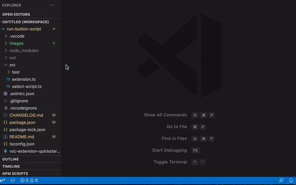

 

# Run button script

A VS Code extension that allows you to run package.json scripts quickly with npm or yarn

## Installation

In the command palette (`CMD + SHIFT + P`) select “Install Extension” and choose “Run button script”.

## Usage

The play button should show up on the right side of title bar when you open a js or ts file
